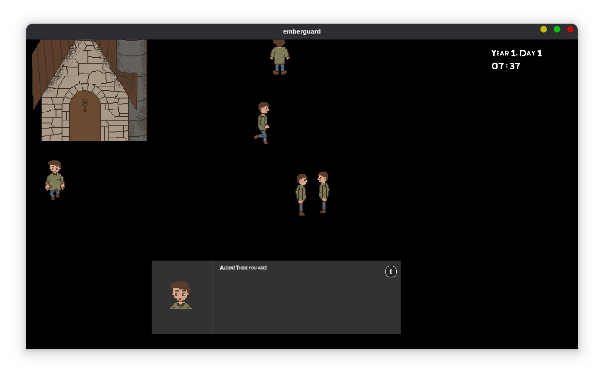
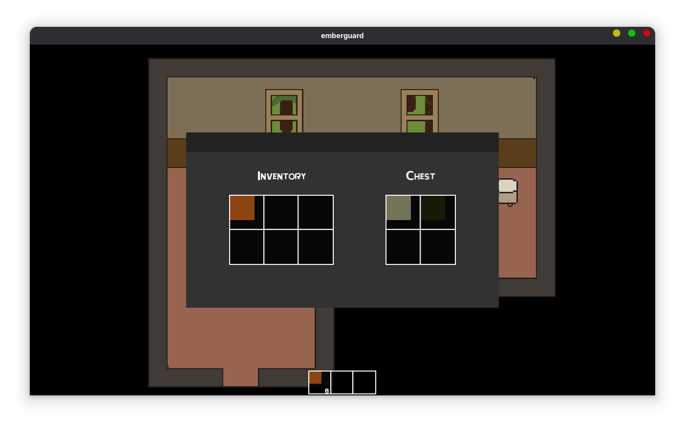
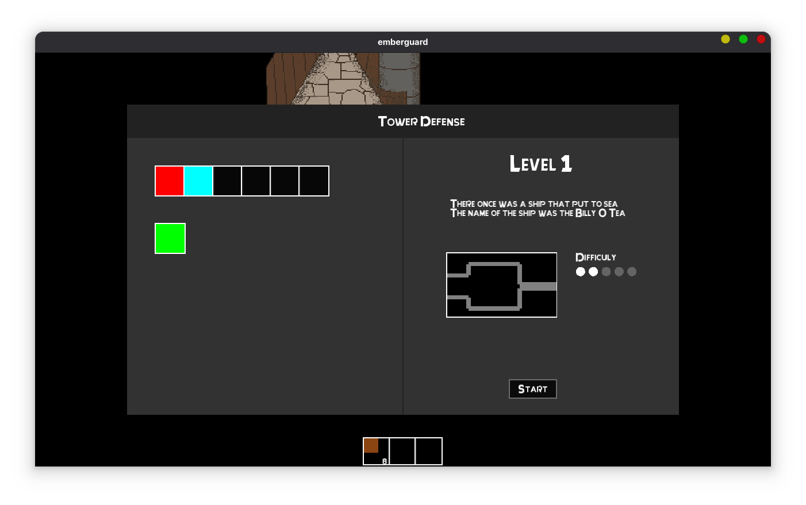
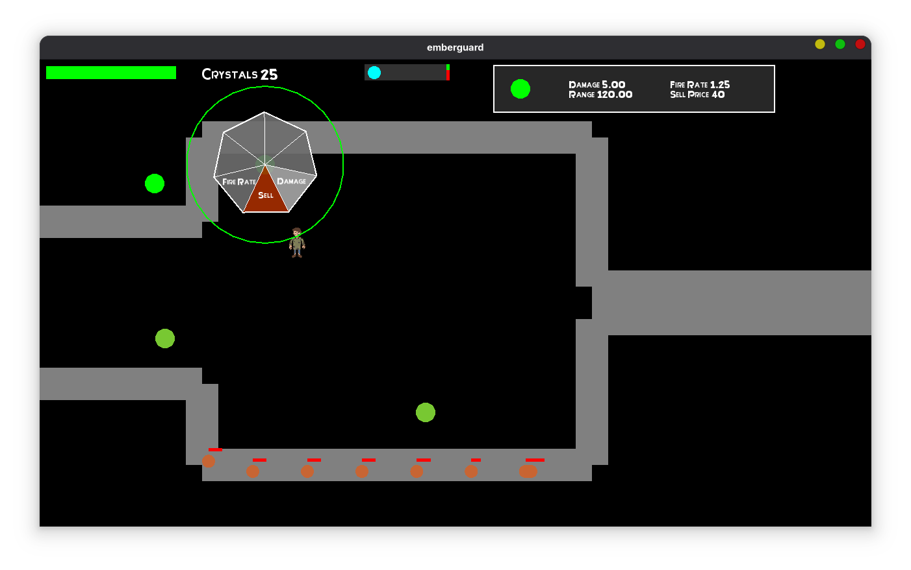

# Emberguard Functionality Overview

## Game Architecture
The game consists of two main modules: **RPG** and **Tower Defense**, each with its own engine and subsystems.

### 1. Core Systems
- **GameManager**: Handles initialization, transitions, and global state.
- **TimeSystem**: Controls time progression and frame updates.
- **TransitionSystem**: Manages scene changes and visual effects.

### 2. RPG Systems
- **Dialogue System**: Loads dialogues from JSON files and executes dialogue actions.
- **Inventory System**: Manages player items, hotbar, and menus.
- **Save System**: Serializes game state into persistent files.

### 3. Tower Defense Systems
- **Enemies**: Handles targeting and movement logic.
- **Towers & Projectiles**: Modular tower hierarchy (LaserTower, FlameTurret) with inheritance for behavior.
- **Wave Manager**: Spawns enemies dynamically and increases difficulty.

### 4. UI and Menus
- Implemented in SFML using custom menu classes (BankMenu, ShopMenu, AnalyzeMenu, etc.).
- Each menu uses event-driven callbacks for interactivity.

## 🎮 Keybinds

| Key | Function |
|-----|-----------|
| **W / A / S / D** | Move the player |
| **E** | Interact with NPCs / Objects |
| **Up / Down / Return** | Navigate and select dialogue choices |
| **Q** | Drop selected item |
| **B** | Open Bank Menu |
| **K** | Open Shop Menu |
| **M** | Open Analyze Menu |
| **L** | Open Start Menu |
| **Escape** | Close menus / pause the game |
| **1 / 2 / 3** | Switch hotbar slot |

## Screenshots

