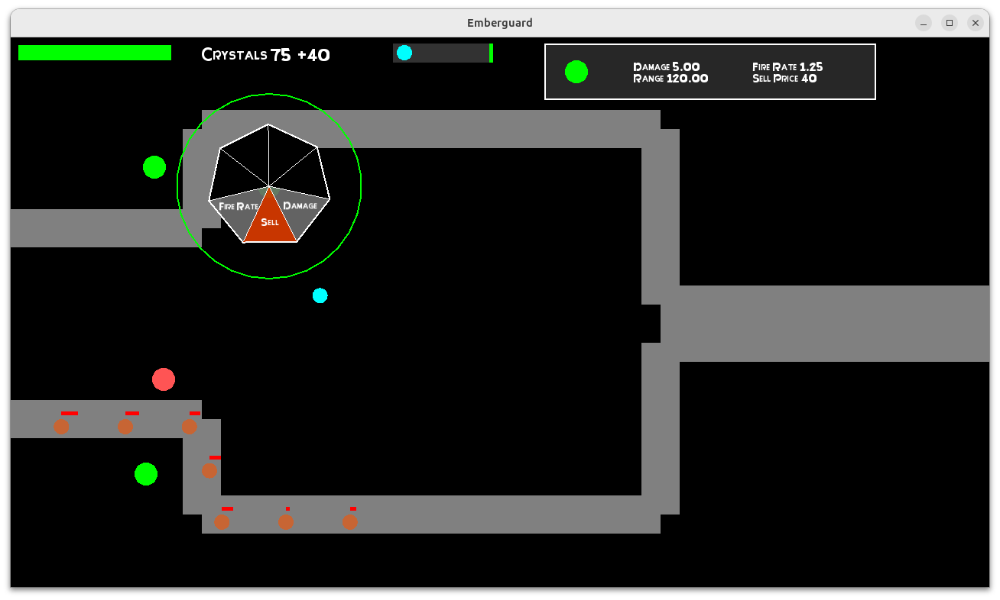

# Emberguard

## Overview
Emberguard is a strategy game where players must defend against waves of enemies using towers. The player can place towers, upgrade them, and navigate through the game using intuitive controls.

## Features
- **Two Tower Types**: Currently, there are two towers available for players to use (Laser Tower and Flame Turret).
- **Player Controls**: 
  - Move using **WASD** keys.
  - Start the game by pressing the **Start Game** button to initiate the enemy waves.
  - Place towers by clicking within the designated placement zone (press **Tab** to view the placement zone represented by a blue circle).
  - Click on existing towers only if they are within the player's placement range to view their stats and upgrade options.
  - Upgrade towers by clicking on them; options include fire rate and damage upgrades. 
    - The upgrade options will indicate if the player has enough crystals: 
      - **Grey** means insufficient crystals.
      - **Green** means sufficient crystals.
  - Sell towers if they are no longer needed.

- **Player Stats**: Pressing **Tab** displays the player stats in the top right corner of the screen.

- **Enemy Interaction**: 
  - Enemies follow the player if they are too close.
  - The player can take damage from enemies within their attack range (viewable by pressing **Tab** and looking at the red circle).
  - The objective is to survive all enemy waves while ensuring both the player and towers have more than 0 health.

## Screenshots

